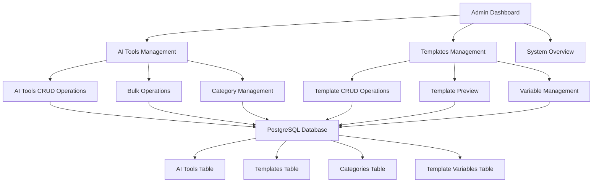

# Design Document

## Overview

Hệ thống quản lý admin được thiết kế để cho phép người dùng không có kiến thức kỹ thuật có thể dễ dàng quản lý toàn bộ 40+ AI tools và Templates của trang web thông qua giao diện trực quan và thân thiện. Hệ thống sử dụng Next.js Server Components để load dữ liệu động từ database PostgreSQL và cung cấp các tính năng CRUD đầy đủ.

## Architecture

### High-Level Architecture



### Technology Stack

- **Frontend**: Next.js 14 với App Router và Server Components
- **Backend**: Next.js API Routes với TypeScript
- **Database**: PostgreSQL với Prisma ORM
- **UI Framework**: Tailwind CSS với shadcn/ui components
- **Authentication**: NextAuth.js với role-based access control
- **State Management**: React Server Components với minimal client state
- **Form Handling**: React Hook Form với Zod validation

## Components and Interfaces

### Database Schema Extensions

Cần thêm các bảng mới vào schema hiện tại:

```sql
-- AI Tools table
CREATE TABLE ai_tools (
    id VARCHAR PRIMARY KEY,
    name VARCHAR NOT NULL,
    description TEXT NOT NULL,
    url VARCHAR NOT NULL,
    category VARCHAR NOT NULL,
    subjects JSON NOT NULL,
    grade_levels JSON NOT NULL,
    use_case TEXT NOT NULL,
    vietnamese_support BOOLEAN DEFAULT false,
    difficulty VARCHAR NOT NULL,
    features JSON NOT NULL,
    pricing_model VARCHAR NOT NULL,
    integration_instructions TEXT,
    sample_prompts JSON,
    related_tools JSON,
    created_at TIMESTAMP DEFAULT NOW(),
    updated_at TIMESTAMP DEFAULT NOW()
);

-- Templates table
CREATE TABLE templates (
    id VARCHAR PRIMARY KEY,
    name VARCHAR NOT NULL,
    description TEXT NOT NULL,
    subject VARCHAR NOT NULL,
    grade_levels JSON NOT NULL,
    output_type VARCHAR NOT NULL,
    template_content TEXT NOT NULL,
    recommended_tools JSON,
    tags JSON,
    difficulty VARCHAR NOT NULL,
    compliance JSON,
    created_at TIMESTAMP DEFAULT NOW(),
    updated_at TIMESTAMP DEFAULT NOW()
);

-- Template Variables table
CREATE TABLE template_variables (
    id VARCHAR PRIMARY KEY,
    template_id VARCHAR REFERENCES templates(id) ON DELETE CASCADE,
    name VARCHAR NOT NULL,
    label VARCHAR NOT NULL,
    description TEXT,
    type VARCHAR NOT NULL,
    required BOOLEAN DEFAULT false,
    placeholder TEXT,
    options JSON,
    default_value TEXT
);

-- Template Examples table
CREATE TABLE template_examples (
    id VARCHAR PRIMARY KEY,
    template_id VARCHAR REFERENCES templates(id) ON DELETE CASCADE,
    title VARCHAR NOT NULL,
    description TEXT,
    sample_input JSON,
    expected_output TEXT
);
```

### Core Components Architecture

#### 1. Admin Layout Component
```typescript
// src/components/admin/AdminLayout.tsx
interface AdminLayoutProps {
    children: React.ReactNode;
    currentSection: 'dashboard' | 'ai-tools' | 'templates' | 'settings';
}
```

#### 2. AI Tools Management Components
```typescript
// src/components/admin/ai-tools/AIToolsManager.tsx
interface AIToolsManagerProps {
    initialTools: AIToolDetails[];
    categories: AIToolCategory[];
}

// src/components/admin/ai-tools/AIToolForm.tsx
interface AIToolFormProps {
    tool?: AIToolDetails;
    onSave: (tool: AIToolDetails) => Promise<void>;
    onCancel: () => void;
}

// src/components/admin/ai-tools/AIToolsTable.tsx
interface AIToolsTableProps {
    tools: AIToolDetails[];
    onEdit: (tool: AIToolDetails) => void;
    onDelete: (toolId: string) => void;
    onBulkAction: (action: string, toolIds: string[]) => void;
}
```

#### 3. Templates Management Components
```typescript
// src/components/admin/templates/TemplatesManager.tsx
interface TemplatesManagerProps {
    initialTemplates: PromptTemplate[];
    subjects: string[];
}

// src/components/admin/templates/TemplateForm.tsx
interface TemplateFormProps {
    template?: PromptTemplate;
    onSave: (template: PromptTemplate) => Promise<void>;
    onCancel: () => void;
}

// src/components/admin/templates/TemplatePreview.tsx
interface TemplatePreviewProps {
    template: PromptTemplate;
    sampleVariables: Record<string, string>;
}
```

### Data Models

#### AI Tool Model
```typescript
interface AIToolDetails {
    id: string;
    name: string;
    description: string;
    url: string;
    category: AIToolCategory;
    subjects: string[];
    gradeLevel: (6 | 7 | 8 | 9)[];
    useCase: string;
    vietnameseSupport: boolean;
    difficulty: 'beginner' | 'intermediate' | 'advanced';
    features: string[];
    pricingModel: 'free' | 'freemium' | 'paid';
    integrationInstructions: string;
    samplePrompts: string[];
    relatedTools: string[];
    createdAt: Date;
    updatedAt: Date;
}

enum AIToolCategory {
    TEXT_GENERATION = 'TEXT_GENERATION',
    PRESENTATION = 'PRESENTATION',
    IMAGE = 'IMAGE',
    VIDEO = 'VIDEO',
    SIMULATION = 'SIMULATION',
    ASSESSMENT = 'ASSESSMENT',
    DATA_ANALYSIS = 'DATA_ANALYSIS'
}
```

#### Template Model
```typescript
interface PromptTemplate {
    id: string;
    name: string;
    description: string;
    subject: string;
    gradeLevel: (6 | 7 | 8 | 9)[];
    outputType: 'lesson-plan' | 'presentation' | 'assessment' | 'interactive' | 'research';
    template: string;
    variables: TemplateVariable[];
    recommendedTools: string[];
    examples: TemplateExample[];
    tags: string[];
    difficulty: 'beginner' | 'intermediate' | 'advanced';
    compliance: string[];
    createdAt: Date;
    updatedAt: Date;
}
```

## Error Handling

### Client-Side Error Handling
```typescript
// src/lib/admin-error-handling.ts
export class AdminError extends Error {
    constructor(
        message: string,
        public code: string,
        public statusCode: number = 500
    ) {
        super(message);
        this.name = 'AdminError';
    }
}

export const handleAdminError = (error: unknown): AdminError => {
    if (error instanceof AdminError) {
        return error;
    }
    
    if (error instanceof Error) {
        return new AdminError(error.message, 'UNKNOWN_ERROR');
    }
    
    return new AdminError('Đã xảy ra lỗi không xác định', 'UNKNOWN_ERROR');
};
```

### Server-Side Error Handling
```typescript
// src/app/api/admin/error-handler.ts
export const withAdminErrorHandler = (handler: Function) => {
    return async (req: NextRequest) => {
        try {
            return await handler(req);
        } catch (error) {
            console.error('Admin API Error:', error);
            
            if (error instanceof AdminError) {
                return NextResponse.json(
                    { error: error.message, code: error.code },
                    { status: error.statusCode }
                );
            }
            
            return NextResponse.json(
                { error: 'Lỗi server nội bộ', code: 'INTERNAL_ERROR' },
                { status: 500 }
            );
        }
    };
};
```

## Testing Strategy

### Unit Testing
- **Components**: Test các admin components với React Testing Library
- **Services**: Test các service functions với Jest
- **API Routes**: Test các API endpoints với supertest
- **Database Operations**: Test Prisma operations với test database

### Integration Testing
- **Admin Workflows**: Test complete admin workflows từ UI đến database
- **Authentication**: Test role-based access control
- **Data Validation**: Test form validation và data integrity

### E2E Testing
- **Admin Dashboard**: Test navigation và basic functionality
- **CRUD Operations**: Test create, read, update, delete operations
- **Bulk Operations**: Test bulk import/export functionality

### Testing Tools
```typescript
// jest.config.js
module.exports = {
    testEnvironment: 'jsdom',
    setupFilesAfterEnv: ['<rootDir>/src/test/setup.ts'],
    testPathIgnorePatterns: ['<rootDir>/.next/', '<rootDir>/node_modules/'],
    moduleNameMapping: {
        '^@/(.*)$': '<rootDir>/src/$1',
    },
};

// src/test/admin-test-utils.tsx
export const renderWithAdminProviders = (ui: React.ReactElement) => {
    return render(
        <SessionProvider session={mockAdminSession}>
            <QueryClient>
                {ui}
            </QueryClient>
        </SessionProvider>
    );
};
```

## Security Considerations

### Authentication & Authorization
```typescript
// src/lib/admin-auth.ts
export const requireAdminRole = async (req: NextRequest) => {
    const session = await getServerSession(authOptions);
    
    if (!session?.user) {
        throw new AdminError('Chưa đăng nhập', 'UNAUTHORIZED', 401);
    }
    
    if (session.user.role !== 'admin') {
        throw new AdminError('Không có quyền truy cập', 'FORBIDDEN', 403);
    }
    
    return session.user;
};
```

### Input Validation
```typescript
// src/lib/admin-validation.ts
import { z } from 'zod';

export const aiToolSchema = z.object({
    name: z.string().min(1, 'Tên công cụ không được để trống'),
    description: z.string().min(10, 'Mô tả phải có ít nhất 10 ký tự'),
    url: z.string().url('URL không hợp lệ'),
    category: z.enum(['TEXT_GENERATION', 'PRESENTATION', 'IMAGE', 'VIDEO', 'SIMULATION', 'ASSESSMENT', 'DATA_ANALYSIS']),
    subjects: z.array(z.string()).min(1, 'Phải chọn ít nhất một môn học'),
    gradeLevel: z.array(z.number().min(6).max(9)).min(1, 'Phải chọn ít nhất một lớp'),
    // ... other validations
});

export const templateSchema = z.object({
    name: z.string().min(1, 'Tên template không được để trống'),
    description: z.string().min(10, 'Mô tả phải có ít nhất 10 ký tự'),
    subject: z.string().min(1, 'Phải chọn môn học'),
    template: z.string().min(50, 'Nội dung template phải có ít nhất 50 ký tự'),
    // ... other validations
});
```

### Data Sanitization
```typescript
// src/lib/admin-sanitization.ts
import DOMPurify from 'isomorphic-dompurify';

export const sanitizeHtml = (html: string): string => {
    return DOMPurify.sanitize(html, {
        ALLOWED_TAGS: ['p', 'br', 'strong', 'em', 'ul', 'ol', 'li'],
        ALLOWED_ATTR: []
    });
};

export const sanitizeInput = (input: string): string => {
    return input.trim().replace(/[<>]/g, '');
};
```

## Performance Optimization

### Server Components Optimization
```typescript
// src/app/admin/ai-tools/page.tsx
export default async function AIToolsPage() {
    // Server-side data fetching
    const tools = await getAITools();
    const categories = await getAIToolCategories();
    
    return (
        <AIToolsManager 
            initialTools={tools}
            categories={categories}
        />
    );
}
```

### Database Optimization
```typescript
// src/lib/repositories/ai-tools-repository.ts
export class AIToolsRepository {
    async getAITools(filters?: AIToolFilters): Promise<AIToolDetails[]> {
        return await prisma.aiTool.findMany({
            where: this.buildWhereClause(filters),
            orderBy: { updatedAt: 'desc' },
            // Include related data efficiently
            include: {
                _count: {
                    select: { relatedTools: true }
                }
            }
        });
    }
    
    async bulkUpdateAITools(updates: BulkUpdateData[]): Promise<void> {
        await prisma.$transaction(
            updates.map(update => 
                prisma.aiTool.update({
                    where: { id: update.id },
                    data: update.data
                })
            )
        );
    }
}
```

### Caching Strategy
```typescript
// src/lib/admin-cache.ts
import { unstable_cache } from 'next/cache';

export const getCachedAITools = unstable_cache(
    async () => {
        return await aiToolsRepository.getAITools();
    },
    ['admin-ai-tools'],
    {
        revalidate: 300, // 5 minutes
        tags: ['ai-tools']
    }
);

export const revalidateAdminCache = () => {
    revalidateTag('ai-tools');
    revalidateTag('templates');
};
```

## User Experience Design

### Navigation Structure
```
Admin Dashboard
├── Tổng quan hệ thống
│   ├── Thống kê AI Tools
│   ├── Thống kê Templates
│   └── Hoạt động gần đây
├── Quản lý AI Tools
│   ├── Danh sách công cụ
│   ├── Thêm công cụ mới
│   ├── Chỉnh sửa hàng loạt
│   └── Import/Export
├── Quản lý Templates
│   ├── Danh sách templates
│   ├── Tạo template mới
│   ├── Preview templates
│   └── Quản lý biến
└── Cài đặt hệ thống
    ├── Backup/Restore
    ├── Audit logs
    └── Cấu hình chung
```

### Responsive Design
- **Desktop**: Full-featured admin interface với sidebar navigation
- **Tablet**: Collapsible sidebar với touch-friendly controls
- **Mobile**: Bottom navigation với simplified views

### Accessibility Features
- **Keyboard Navigation**: Full keyboard support cho tất cả functions
- **Screen Reader**: ARIA labels và semantic HTML
- **Color Contrast**: WCAG 2.1 AA compliant color scheme
- **Focus Management**: Clear focus indicators và logical tab order

## Deployment Considerations

### Environment Configuration
```typescript
// src/lib/admin-config.ts
export const adminConfig = {
    maxFileUploadSize: process.env.MAX_FILE_UPLOAD_SIZE || '10MB',
    allowedFileTypes: ['json', 'csv', 'xlsx'],
    backupRetentionDays: parseInt(process.env.BACKUP_RETENTION_DAYS || '30'),
    auditLogRetentionDays: parseInt(process.env.AUDIT_LOG_RETENTION_DAYS || '90'),
};
```

### Database Migrations
```sql
-- Migration: Add admin tables
-- File: prisma/migrations/xxx_add_admin_tables.sql

-- Create AI Tools table
CREATE TABLE ai_tools (
    -- schema definition
);

-- Create Templates table  
CREATE TABLE templates (
    -- schema definition
);

-- Create indexes for performance
CREATE INDEX idx_ai_tools_category ON ai_tools(category);
CREATE INDEX idx_ai_tools_subjects ON ai_tools USING GIN(subjects);
CREATE INDEX idx_templates_subject ON templates(subject);
CREATE INDEX idx_templates_grade_levels ON templates USING GIN(grade_levels);
```

### Monitoring & Logging
```typescript
// src/lib/admin-monitoring.ts
export const logAdminAction = async (
    userId: string,
    action: string,
    resource: string,
    details?: any
) => {
    await prisma.adminAuditLog.create({
        data: {
            userId,
            action,
            resource,
            details: JSON.stringify(details),
            timestamp: new Date(),
            ipAddress: getClientIP(),
            userAgent: getUserAgent()
        }
    });
};
```

Thiết kế này đảm bảo hệ thống admin sẽ có hiệu suất cao, bảo mật tốt và dễ sử dụng cho người dùng không có kiến thức kỹ thuật.